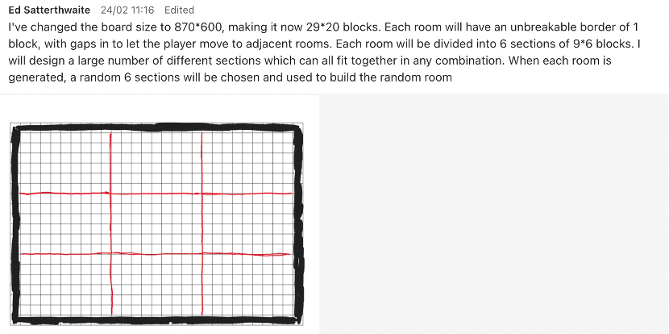

# COMSM0110 - Group 7 (2023)

## 1. Team

Team photo to be added

| Name             | Email                 |
| ---------------- | --------------------- |
| Xiao Yuan        | lq22159@bristol.ac.uk |
| Yue Wang         | pe22209@bristol.ac.uk |
| Arlo SUN         | xa22653@bristol.ac.uk |
| Ed Satterthwaite | es16268@bristol.ac.uk |
| Cedric Chen      | ud22762@bristol.ac.uk |

## 2. Introduction (5% ~250 words)

o Describe your game, what is based on, what makes it novel?

Game Background: The Earth's resources have been exhausted and the protagonist arrives on an alien planet to collect energy minerals. This planet is rich in mineral resources but is also full of danger. Our protagonist needs to survive under the pursuit of alien monsters and obtain as many resources as possible!
Game Type: Roguelike + Dungeon + Cave Exploration + Side-scrolling Shooter
Every map and its elements, including monsters, are randomly generated! Item drops are also completely random!

## 3. Requirements (15% ~750 words)

o Use case diagrams
  

  

Use case diagrams and user stories are kept in folder 'ReportMaterials' in gitub mainpage for your reference.

https://github.com/UoB-COMSM0110/2023-group-7/tree/main/ReportMaterials

o User stories

As a player I want to play a character with different combination of weapons so that have personalized game experience.

As a player I want to explore different dungeons rooms so that experience the joy of unknown.

As a player I want to encounter with different enemies with different skills and difficulty so that devote thought to planning survival routes and game strategies.

As a player I want to discover different items to improve weapon power or make the survival easier so that pay attention to collect item while fighting with monsters and increase fun of the game.

As a player I want to change game difficulties and there are some defined levels so that I can choose them according to my level and make game experience better.

As a player I want to experience permadeath so that I need to make every decision carefully and compete with others for scores.

As a player I want to experience different movement method so that the game has more possibilities and be unexpected rescued from a desperate situation

As a player I want to interact with map elements such as portal so that the game become much more interesting, and I can make strategies with these things.

As a player I want to heal my HP so that there still chances to survive even I make a strategy mistake.

As a player I want to experience a game that the difficulty level increase by time so that the game become more interesting soul-stirring with time going by in the case that the play is used to current difficulty.

As a player I want to pause the game while playing so that I could continue the game after I resolve emergency.

As a player I want to store my game score and compare with other players so that I can be hungrier for score and feel fulfilled when I beat other players.

As a player I want to turn off the game music so that I can focus on the game without being influenced by background music.

As a player I want to check the game tutorial or help at the start menu as well as in the game so that I can learn the operation method when I first play it and check help tips when I forget some operations in game.

As a player I want to be hurt by map elements so that I need to focus on every moment
As a player I want to pick up items that could increase my score so that I'm more enthusiastic to explore the game.

As a player I want to double jump in the game so that I can move more flexible.

As a developer I want to design a game room and map generation algorithm so that the game has more possibilities and more interesting to explore.

As a developer I want to design several weapons so that the game experience is personalized.

As a developer I want to design background music and different sound effects so that the player could be more immersed into the game.

As a developer I want to have different artistical art and animation design so that the player has better game experience.

As a developer I want to design menus for different settings so that the player could personalize their playing easily.

o Early stages design and ideation process. How did you decide as a team what to develop?

At early stages, each member in the team brought up at least 2 games ideas to develop. We discussed and evaluated all ideas from a wide range of aspects which game we are going to build, for example, the possibilities of twists for each game, potential game users, a more original game, how it works (interactions between enemies and player) etc.

Finally, we reached a consensus of which game to develop as we all agreed on a rough-like game and clearer picture of our game. Initially we have a general aim for our game, for example, game background setting, space mission and exploring, various landscapes (rooms), various enemies, score system, items system etc.

## 4. Design (15% ~750 words)

o Design details (OUTLINE)

Concept and Theme: Start by developing a unique concept or theme for your game. This could be inspired by a specific setting, mythology, or an interesting twist on traditional rogue-like games. The theme will help guide the overall design and create a cohesive experience for the players.

Game Mechanics: Define the core game mechanics, such as turn-based gameplay, combat system, character progression, and inventory management. Consider how these mechanics will interact and create a fun and challenging experience for the players. At this stage, it's important to decide on the level of complexity and depth that you want for your game.

Procedural Generation: One of the key aspects of rogue-like games is procedurally generated levels. Plan the algorithms and techniques that will be used to create diverse and engaging dungeons, ensuring that each playthrough offers a unique experience. Consider how the procedural generation will affect the game's difficulty, pacing, and replayability.

Character Creation and Progression: Design the system for creating and customizing player characters, including attributes, abilities, and appearance options. Decide on the character progression system, including experience points, leveling up, and unlocking new abilities. Consider incorporating permadeath and how it will affect the overall gameplay experience.

Enemy Design: Plan the variety of enemies and bosses that the players will encounter throughout the game. Define their abilities, behaviors, and difficulty levels, ensuring that they provide an engaging and challenging experience for the players.

Items and Equipment: Design a diverse set of items, weapons, and armor that players can discover and use throughout the game. Consider how these items will impact the player's strategy, progression, and overall gameplay experience.

Visual and Audio Design: Develop the visual and audio style for the game, including character and environment art, animations, sound effects, and music. The visual and audio design should complement the game's theme and create an immersive and engaging experience for the players.

User Interface and Controls: Design the user interface and control scheme for the game, ensuring that it's intuitive and accessible for the players. Consider how the interface will adapt to different platforms, such as PC, console, or mobile devices.

Story and Lore: Although not always a focus in rogue-like games, you may want to develop a story or lore that adds depth and context to the game world. This can help create a more immersive experience and encourage players to explore the game world more thoroughly.

Prototyping and Iteration: In the early stage of design, it's important to create prototypes and iterate on the game mechanics, level generation, and other aspects of the game. This allows you to test and refine your ideas, ensuring that the game is fun, balanced, and engaging for the players.

o System architecture (OUTLINE)

System architecture design is a critical aspect of game development, as it provides the structure and organization for the various components of the game. It helps to ensure that the game is scalable, maintainable, and can be developed efficiently. Here are some key elements to consider when designing the system architecture for a game:

Game Engine: The game engine is the core software framework that powers the game. It provides essential features and tools, such as rendering, physics, animation, and artificial intelligence. You can either choose to use a pre-built engine like Unity or Unreal Engine or create a custom engine tailored to your specific needs.

Game Logic: Design the game logic, which includes the rules and mechanics of the game, such as character progression, combat, and level generation. This should be separated from the rendering and engine systems, allowing for easier updates and modifications to the game's core functionality.

Data Management: Design the data management system, which stores and organizes the game's data, such as level layouts, character attributes, and item properties. This may involve creating databases, file formats, or other data storage solutions, ensuring that data can be accessed and modified efficiently.

Asset Management: Create a system for managing the game's assets, such as textures, models, animations, and sound files. This may involve developing a custom asset pipeline or using existing tools and libraries, ensuring that assets can be imported, organized, and utilized efficiently within the game.

Networking: If your game includes multiplayer functionality, design the networking architecture, which involves setting up servers, managing connections, and synchronizing game states between players. This may also involve developing systems for matchmaking, leaderboards, and other online features.

User Interface: Design the user interface (UI) system, which includes the layout, controls, and visual elements that the players interact with. This should be modular and flexible, allowing for easy updates and changes to the UI as needed.

Input Handling: Create a system for handling player input, such as keyboard, mouse, or controller inputs. This should be adaptable to different platforms and devices, ensuring that the game can be played on a variety of systems.

Scripting and Event Systems: Design the scripting and event systems, which allow for custom game logic, interactions, and behaviors to be implemented without modifying the core engine code. This may involve creating a custom scripting language or utilizing existing scripting languages like Lua or Python.

Audio: Design the audio system, which includes managing sound effects, background music, and voiceovers. This may involve integrating middleware like FMOD or Wwise to handle audio playback, mixing, and spatialization.

Performance and Optimization: Design the game's architecture with performance and optimization in mind, ensuring that the game runs smoothly on a variety of hardware configurations. This may involve implementing techniques like level-of-detail, culling, and asset streaming to improve performance.

o Class diagrams
  

  

  

o Behavioural diagrams
  

  

Behavioural diagrams are kept in folder 'ReportMaterials' in gitub mainpage for your reference.

https://github.com/UoB-COMSM0110/2023-group-7/tree/main/ReportMaterials

The game is based on MVC model to build. We worked and discussed as a team to decide what are the game mechanics , how the player might behave ( things that player does : exploring unknown areas , mining, using items to deal with various creatures etc.) , what should be displayed on the interface ( the way player communicate with game , HP system, score system , creatures AI etc.).

We illustrated them in class diagrams. Generally, we needed several basic classes to validate the game. Class for view & model & controller, class for random room , class for player, class for various creatures, class for items etc.

## 5. Implementation (15% ~750 words)

We follow the general game developement process to implement our game : planning -- pre-production -- production -- testing -- pre-launch -- release.

We have weekly meeting to summarize what we have done for the project, discussed current difficulties during development for own part, clarified ambiguities, brought up possible new features for games and added them in our process.

During the implementation of our game, we found below 3 main challenges :

### 5.1 Randomly generated map and elements:

Our goal with the random generation of rooms, was for every level to look and feel distinctly different. The main problems faced here were ensuring that every room has at least one path the player can follow, and that there are no areas where the player or enemies can get stuck. 

Our solution was to use a pseudo-randomly generated approach. The board size is set to 1160 by 800 pixels and is divided into a grid of 29 by 20 blocks. Each room has a border or 1 block with 6 exits, and the remaining space is then divided into 6 sections, each of 9*9 blocks (see figure x). The sections are stored in CSV files, and dictate the placement of normal blocks, jump pads and portals. We carefully designed a large number of different sections and carried out user testing to ensure that they fit together in any combination without impending on the players movement. 

When each room is generated, 6 sections are chosen at random and used to build the room. The logic for this generation is designed in such a way that no room can contain two identical sections. Next, we optimise the room, adding in some additional special platforms to make gameplay more dynamic. We then scan the room to find suitable locations for elements such as enemies and items. These elements are then added to randomly selected locations. 

  

  

  

### 5.2 Collision detection:

Collision detection is one of the most important aspects of our game. We are always looking for better ways of collision detection and keep it constantly updated.

In the beginning, basic collision detection was based on rectangular and rectangular collisions. At that stage, the position and size depended on the floats x, y, width, height and then, for ease of development, it was modified to be determined by the PVector location. We have rewritten the detect method to meet the collision detection of each type of object according to different needs.

For example, if a room in the game is made up of blocks based on matrix coordinates, our algorithm only needs to detect the walls around the object to reduce performance consumption. Also, the improved algorithm can match objects of arbitrary position and size. The effect of a moving object (e.g. player, enemy) being blocked by a wall is achieved by resetting the PVector location of the object and clearing the PVector velocity in the corresponding direction. If the object is blocked by a wall below, then the jump and fall states of the moving object are reset. Different strategies are used for collision detection for the player and the enemy, so that the enemy does not cross the boundary and cause a bug.

It is fair to say that we have spent considerable effort on collision detection and have achieved more than satisfactory results, which have greatly enhanced the gaming experience.

### 5.3 Performance effects：

We have spent a lot of time and effort on the presentation to make everything as perfect as possible, like a full-fledged game.

In many cases, we have replaced single image effects with gifs, so that many of the effects are played in a continuous motion picture. By using the DecorationFactory, we can add both temporary and permanent gifs to the room, and set duration, speed, size and location of gifs by using different constructors. For example, when the player dies, the player does not suddenly fall, but has a complete set of movements. There are also different matching gifs for the player and the enemy in different states: for example, when the player or the enemy is attacked, there is a knockback effect; when the player is injured, there is an invincibility time as well as a blinking effect.

Another notable mention is our shooting system. We have used the PVector system instead of the traditional x, y and speed coordinate system. We used the PVector to make the weapon follow the rotation of the mouse position, as well as to ensure that the bullets are fired from the muzzle, again contributing to the hitting effect in the previous section.

## 6. Evaluation (15% ~750 words)

### 6.1 Qualitative evaluation：

We used the Think Aloud evaluation method to conduct qualitative testing of the game. We invited test users to explore the game pages and content freely and without guidance from the developers, while asking them to express their thoughts aloud.

During this test, we identified the following issues for improvement (surely that’s not all): the need for more tutorials (including an introduction to the various items and weapons, basic operations, etc.); the need to improve the operations according to habits, e.g. the 'SPACE' and 'W' keys can both be used to 'jump'; the lack of visibility of entrances and exits on the game screen and the need to add guidance; the difficulty of the game needs to be adjusted, for example, players think the drop damage needs to be reduced.

We also found it interesting to note that, because we did not select our test players, there was a significant difference in the feedback on the experience between players with and without relevant gaming experience. It took some time to learn and accept the keys and attack patterns for the first time, so we needed to give enough guidance at the beginning of the game to enhance the experience (otherwise it would have been a disguised way to make it harder and turn off players).

Based on these results, we have decided to improve the guidelines and create a more user-friendly tutorial. We have also adjusted the props and values to correct the difficulty of the game. And also to emphasise the player's goal: to get more score.

### 6.2 Quantitative evaluation：

We gathered around ten players to fully conduct that test. The process was as follows: we gave a brief introduction to the game and its operation, the players started to experience the game and finally filled in two forms, System Usability Scale and NASA TLX, based on their real thoughts.

In NASA TLX, we did not use weights for the six dimensions. Combining the scoring data reveals a large variation in the perception of the game's tasks between test users, which may be related to players' gaming experience and their own familiarity with the genre. Combining the independent mean scores for each dimension we find that players generally perceive the level of thinking required and effort required to play the game to be high, and that players are satisfied with their performance.
  

  

With players generally giving relatively good usability ratings (satisfactory scores) in SUS, it is fair to say that our game system has a good track record. This includes the fact that players found our system simple and easy to use and the tasks easy to understand. At the same time, some issues were also reflected, such as the fact that players felt they needed some time and some learning to use it. This echoes the issues reported by users during the Think Aloud evaluation in the previous section.
  

  

### 6.3 How code was tested：

Given that the development is using Processing, we are currently unable to perform further unit testing on the code etc., so we have chosen to focus our testing on user testing.

For user testing, we have used the Think Aloud evaluation, NASA TLX and System Usability Survey (SUS) methods. In the Think Aloud evaluation, we let the testers explore the interface and content of the game without any guidance from the developers and asked them to express their thoughts out loud during the exploration process. We can quantify and analyse the results of the survey to draw conclusions and make the game better and more user-friendly.

Based on the results of the table and the player testimonials we found that, overall, players do not find our game system complicated, but may need some guidance to learn it. Basically, they think we have a strong gameplay and show that they want to play often. It may be necessary to maintain a tense state of operation while playing to keep the game experience going. Happily, almost all players praised our game's graphics and gameplay. Another point that deserves our attention is that, due to the lack of guidance, it seems difficult for players to realise that the goal of our game is to "mine for more points" (rather than to "stay alive").

## 7. Process (15% ~750 words)

o Teamwork. How did you work together, what tools did you use? Did you have team roles? Reflection on how you worked together.

How did we work together?

We adopted a quite flexible and collaborative approach for game development. Generally, we have a weekly meeting in lab and on teams during holiday, to go through every aspect of the game development, we have one team member jotted down meeting notes each week and assign tasks to team member who is in charge for that in Jira. We posted our questions on teams to get instant feedback or to get support, or to fix bugs, and we committed our work to GitHub so everyone in team could see the changes and monitor our process to ensure our work hit the weekly schedule.

Here are some screenshots for how we collaborated as a team.

- Shared meeting notes
- Shared good ideas
- Shared public methods so others can make full use of the codes and avoid repetition
- Shared good software
- Helped to fix bugs
- Shared the change that might affect everyone’s development to keep everyone stay up to date
  
  

      
       Screenshot of proposing games to develops
         
      
        Screenshot of meeting notes example - 1
        
      
       Screenshot of meeting notes example - 2
        
      
       Screenshot of sharing good software
          
        
      
       Screenshot of sharing changes
          
      
       Screenshot of sharing good ideas for generating maps for game
          
        
       Screenshot of helping to fix bug
          

What software did we use?

Yes, we used various software introduced from the lecture.

- Teams: communication and meeting
- Jira: Assigned tasks and monitored our progress
- UML: Illustrated class diagrams
- Git & GitHub: for version control and committed staged work
- Photoshop: designed certain character in game
- Processing: wrote codes to build the game
    

       
     Screenshot of using Jira to assign tasks and monitor progress

    
 Also please follow below link if you want to check how we collaborate in Jira. 
https://uob-group7.atlassian.net/jira/software/projects/GP/boards/1
  
Did you have team roles?

Yes, we divided the game into 5 parts at beginning of the project, so everyone can focus on his or her own part. Please find below table as how we assign the team role.

| Task                                | To do by |
| ----------------------------------- | -------- |
| Rooms & Room Factory                | Ed       |
| Menu & Setting & BGM                | Arlo     |
| Player, Basic props, Collision etc… | Xiao     |
| Items & Items Factory               | Yue      |
| Enemy & Enemy Factory               | Cedric   |

Meanwhile, apart from the game, there are some works have been done by different team members:

- kept tracking and pushing the progress to ensure delivery of the game
- jotted down meeting note and shared recap
- Assigned tasks regarding meeting
- Acted as user or found new user to play game and asked for feedback
- Reached out to internet for game design (player, enemies, items, gems & rocks etc..), as we wanted it our game in an extraterrestrial world setting
    

## 8. Conclusion (10% ~500 words)

o Reflect on project as a whole. Lessons learned. Reflect on challenges. Future work.

Overall, the game is basically a 2D platform adventure game and is inspired by Spelunky. But we re-designed the game to make it more originally made by our own. for example, extraterrestrial planet background setting, all elements shown in the game are consistent with the game storyline , completely random generated maps, items, enemies to make the game more fun to play.

From software quality perspective,we think we have met the requirements of game development. Firstly, the game is fun to play. Secondly, the codes have been conformed with our conventions, it's readable and maintainable, and had been tested and reviewed again and again to make it as concise and accurate as we can.

The project is absolutely challenging and here are some tricky challenges that we had in the process:

- Enemies and rooms are generated randomly, it's difficult to make sure enemies were generated legally in the right place
- Various enemy AI
- Collision detection between player and creatures and spikes
- Dynamically display player and enemies

Basically, our approach to solve question is that We brought the questions to meeting and devided them into smaller parts.We proposed a potential viable solution , tested it and revised it , conquered them step by step. Our strategy is that we try to complete the basics of the game and made it functional. Then we improved it and added new features and beatify characters and game interface by each round's sprint.

Thus, we are very proud of the game we have developed, it is thrilling to present our final game for end users to play.
During the process,we not just have gained valuable experience to develop a new game , but also learnt to collaborate as a team. Meanwhile, learnt to make full use of various software to improve efficiency.

Finally, we decided to put below features to our future work as time is limited:

- Phase in user login system which can allow to store users information, play records and rank their scores
- Validate the game for two players , it might be more fun if players can help and interact with each other in space exploration
- Validate the game for connecting internet, so players can share their scores
- More various bosses for player to challenge
- Generate more interesting various secret maps, so players can unlock it and get unexpected bonus
- More enemies and more items that allow player to create new playing methods and play more flexibly
- Provide more items for player to use, like immute death , summon NPC to attack emermies , special shield to help user to reflect the damage etc..
- Provide a bag system so user to check current available items and instructions for them
- A complete introduction of game storyline for user to better understand its background and goal
- Phase in quests system, player can unlock quests to increase their scores or boost its effects
